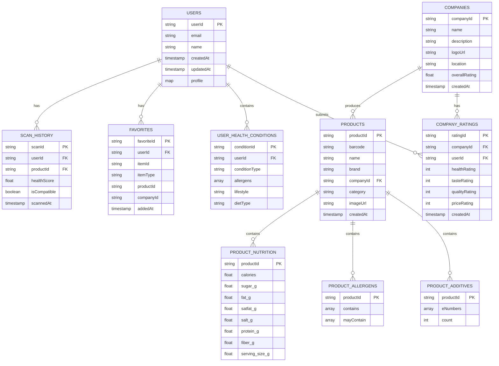
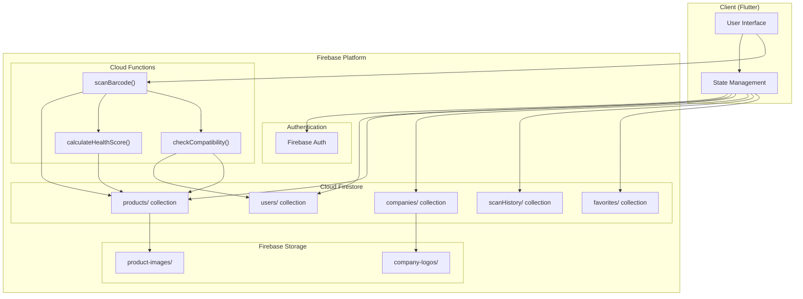

# Database Schema

## Overview

ProdEye uses **Cloud Firestore** as its primary database. This document describes the complete data structure, relationships, and data flow.

## Entity Relationship Diagram



## Data Flow Diagram



## Collections

### 1. Users Collection

**Path**: `users/{userId}`

Stores user profile information and health preferences.

| Field | Type | Description |
|-------|------|-------------|
| `userId` | String | Firebase Auth UID (PK) |
| `email` | String | User email address |
| `name` | String | Display name |
| `profile` | Map | User demographics |
| `healthProfile` | Map | Health conditions and preferences |
| `createdAt` | Timestamp | Account creation date |
| `updatedAt` | Timestamp | Last update timestamp |

**Profile Map Structure**:
```javascript
{
  "age": 30,
  "gender": "male", // or "female"
  "height": 175,    // cm
  "weight": 75,     // kg
  "activityLevel": 1.55 // PAL multiplier
}
```

**Health Profile Map**:
```javascript
{
  "conditions": ["diabetes", "hypertension"],
  "allergens": ["lactose", "gluten"],
  "lifestyle": "healthy",
  "dietType": "normal"
}
```

### 2. Products Collection

**Path**: `products/{productId}`

Central repository of all food products in the database.

| Field | Type | Description |
|-------|------|-------------|
| `productId` | String | Unique identifier (PK) |
| `barcode` | String | EAN/UPC barcode |
| `name` | String | Product name |
| `brand` | String | Brand name |
| `companyId` | String | Reference to manufacturer (FK) |
| `category` | String | Food category |
| `imageUrl` | String | Firebase Storage URL |
| `nutrition` | Map | Nutritional information |
| `allergens` | Map | Allergen information |
| `additives` | Map | Additive information |
| `createdAt` | Timestamp | Entry creation date |
| `updatedAt` | Timestamp | Last update date |

**Nutrition Map**:
```javascript
{
  "servingSize": 100,    // grams
  "calories": 250,       // kcal
  "sugar": 15.0,         // grams
  "fat": 8.0,            // grams
  "saturatedFat": 3.0,   // grams
  "salt": 1.2,           // grams
  "protein": 5.0,        // grams
  "fiber": 2.0           // grams (optional)
}
```

**Allergens Map**:
```javascript
{
  "contains": ["lactose", "gluten"],
  "mayContain": ["nuts", "soy"]
}
```

**Additives Map**:
```javascript
{
  "eNumbers": ["E100", "E440"],
  "count": 2
}
```

### 3. Companies Collection

**Path**: `companies/{companyId}`

Algerian food manufacturers and brands.

| Field | Type | Description |
|-------|------|-------------|
| `companyId` | String | Unique identifier (PK) |
| `name` | String | Company name |
| `description` | String | Company description |
| `logoUrl` | String | Logo image URL |
| `location` | String | City/Region in Algeria |
| `website` | String | Website URL |
| `ratingStats` | Map | Aggregate rating data |
| `productCount` | Number | Number of products |
| `createdAt` | Timestamp | Entry creation date |

**Rating Stats Map**:
```javascript
{
  "healthRating": 4.2,
  "tasteRating": 3.8,
  "qualityRating": 4.0,
  "priceRating": 3.5,
  "totalRatings": 156
}
```

### 4. Scan History Collection

**Path**: `scanHistory/{userId}/scans/{scanId}`

Subcollection storing each user's scan activity.

| Field | Type | Description |
|-------|------|-------------|
| `scanId` | String | Unique scan identifier (PK) |
| `userId` | String | User reference (FK) |
| `productId` | String | Product scanned (FK) |
| `barcode` | String | Scanned barcode |
| `healthScore` | Number | Calculated score (0-100) |
| `compatibility` | Map | Compatibility results |
| `scannedAt` | Timestamp | Scan timestamp |

**Compatibility Map**:
```javascript
{
  "isCompatible": false,
  "warnings": [
    "Contains lactose - not suitable for lactose intolerance",
    "High sugar content - not suitable for diabetes"
  ]
}
```

### 5. Favorites Collection

**Path**: `favorites/{userId}/items/{favoriteId}`

User-saved products and companies.

| Field | Type | Description |
|-------|------|-------------|
| `favoriteId` | String | Unique identifier (PK) |
| `userId` | String | User reference (FK) |
| `itemType` | String | "product" or "company" |
| `itemId` | String | ProductId or CompanyId |
| `productData` | Map | Cached product info (if type=product) |
| `companyData` | Map | Cached company info (if type=company) |
| `addedAt` | Timestamp | When favorited |

## Indexes

### Required Composite Indexes

| Collection | Fields | Purpose |
|------------|--------|---------|
| `scanHistory/{userId}/scans` | `scannedAt` (desc) | Recent scans first |
| `products` | `category`, `name` | Category filtering |
| `companies` | `overallRating` (desc) | Top-rated companies |

## Security Rules

```javascript
rules_version = '2';
service cloud.firestore {
  match /databases/{database}/documents {
    // User documents - users can only access their own
    match /users/{userId} {
      allow read, write: if request.auth != null 
                        && request.auth.uid == userId;
    }
    
    // Products - publicly readable, admin writable
    match /products/{productId} {
      allow read: if true;
      allow write: if false; // Only via Cloud Functions
    }
    
    // Companies - publicly readable
    match /companies/{companyId} {
      allow read: if true;
      allow write: if false;
    }
    
    // Scan history - user can only access own scans
    match /scanHistory/{userId}/scans/{scanId} {
      allow read, write: if request.auth != null 
                        && request.auth.uid == userId;
    }
    
    // Favorites - user can only access own favorites
    match /favorites/{userId}/items/{favoriteId} {
      allow read, write: if request.auth != null 
                        && request.auth.uid == userId;
    }
  }
}
```

## Data Relationships

### One-to-Many Relationships

| Parent | Child | Relationship |
|--------|-------|--------------|
| User | Scan History | One user has many scans |
| User | Favorites | One user has many favorites |
| Company | Products | One company has many products |

### Many-to-Many Relationships

| Entity 1 | Entity 2 | Junction Collection |
|----------|----------|-------------------|
| Users | Products | scanHistory + favorites |
| Users | Companies | favorites |

## Data Retention

| Collection | Retention Policy |
|------------|-----------------|
| `scanHistory` | Keep 90 days, archive older |
| `favorites` | Permanent until user deletes |
| `users` | Permanent, anonymize on deletion |

---

For architecture overview, see [ARCHITECTURE.md](ARCHITECTURE.md).
For API details, see [API_DOCUMENTATION.md](API_DOCUMENTATION.md).
